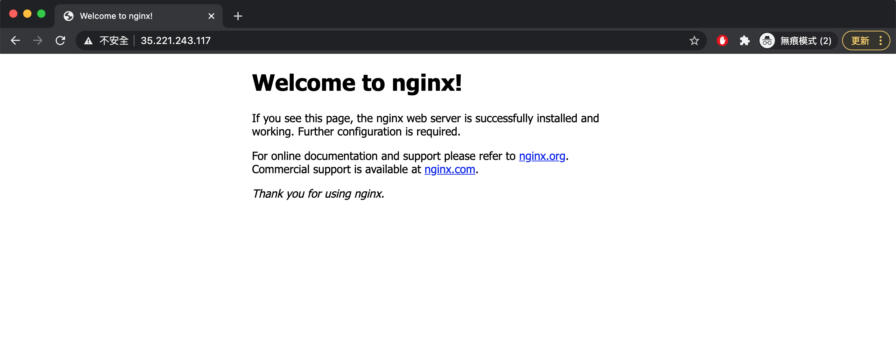

### 注意事項：
* 範例皆以乾淨的環境運行，因此會在步驟中重新建立堆疊。若您的堆疊已含有其它資源，部署的結果可能會與範例結果有所差異，請先透過以下指令清除相關資源再開始我們的範例：
    1. 刪除資源： `pulumi destroy`
    2. 刪除堆疊： `pulumi rm stack <stack_name>`

# 目標
建立 GCP Instance，並且：
1. 允許 SSH 登入
2. 啟用 Docker 服務
3. 運行 Nginx 容器，並允許從外部進行 `http` 存取

# 步驟
1. 在 Local 端建立登入的 sshkey
    ```bash
    $ ssh-keygen -C "demouser@demo-instance" -f "${PWD}/id_rsa"
    ```
2. 準備運行環境 `venv`
    ```bash
    $ python3 -m venv venv
    $ source venv/bin/activate
    $ pip3 install -r requirements.txt
    ```
3. 建立 `dev` 堆疊
    ```bash
    $ pulumi stack init dev
    ```
4. 設定 GCP 專案
    ```bash
    $ pulumi config set gcp:project <gcp_project_name>
    ```
5. 透過 `pulumi config set --secret` 新增 secret 變數
    ```bash
    # sshkey 值的格式為 <username>:<id_rsa.pub>
    $ pulumi config set --secret sshkey "demouser:ssh-rsa AAAAB3NzaC1yc2EAAA ...."
    ```
6. 執行部署
    ```bash
    $ pulumi up
    ...
        Type                     Name                     Status
    +   pulumi:pulumi:Stack      instance-with-nginx-dev  created
    +   ├─ gcp:compute:Address   demo-instance-address    created
    +   ├─ gcp:compute:Network   default-network          created
    +   ├─ gcp:compute:Firewall  firewall                 created
    +   └─ gcp:compute:Instance  demo-instance            created

    Outputs:
        instanceIP  : "35.221.243.117"
        instanceName: "demo-instance-fa0777d"
        sshkey      : "[secret]"

    Resources:
        + 5 created

    Duration: 1m24s
    ```
7. 開啟瀏覽器，輸入 `http://<instanceIP>:80`
    
8. 或是，SSH 登入主機，確認 Nginx 容器運行狀態
    ```bash
    $ ssh -i id_rsa demouser@instanceIP
    ```
    確認 Nginx 容器運行狀態
    ```bash
    demouser@demo-instance-fa0777d:~$ sudo docker ps
    CONTAINER ID   IMAGE     COMMAND                  CREATED         STATUS         PORTS                NAMES
    295ecab92776   nginx     "/docker-entrypoint.…"   5 minutes ago   Up 5 minutes   0.0.0.0:80->80/tcp   nginx
    ```